# Human Resource Management System Application
## Table of Content
* [Overview](#overview)
* [Objective](#objective)
* [Technologies Used](#technologies-used)
* [Features](#features)
* [Room for Improvement](#room-for-improvement)
* [Progress](#progress)
* [Contact](#contact)
## Overview
As part of our training at Tunga Tech Impact Academy, we have been tasked to develop a software solution to help organizations manage and optimize their human resource functions such as employee onboarding, attendance tracking, leave management, and reporting.
## Demo Links
*[Frontend-Web App](https://plutohr.onrender.com/)
*[Backend-API](https://plutohr-yh2n.onrender.com/api/schema/swagger-ui/)
## Objective
Develop an HR system to address the most essential functionalities needed to
streamline Human Resource processes and improve employee management
within the organization.
## Technologies Used
### 1. Backend Dependencies
Our tech stack includes the following:
- Python - version 3.12
- Django - version 5.0.6
- SqLite (Database)
### 2. Frontend Dependencies
Our tech stack includes the following:
- React - 18.3.1
- CSS3
- HTML5
## Features
Ready features
- Login for managers and employees
- Displaying manager or employee dashboard based on the user role
- Manager Dashboard to allow managers to perform manager tasks
- Employee dashboard to allow employees to perform employee tasks
- Managers can add, edit, or delete an employee
- Employees can apply for leave
- Managers can approve or reject leave requests
- Displaying pending, accepted, or rejected leave requests for managers
- Attendance tracking feature to take in employee login and logout details
- Displaying all attendance data for all employees to managers
- Displaying employee attendance data to the employee
- Displaying real-time working hours for employees
- Report generation page for downloading CSV or PDF files summarizing all or an employee's information.
- Logout notification for users to confirm logging out.
- Added responsiveness to the system

## Screenshots
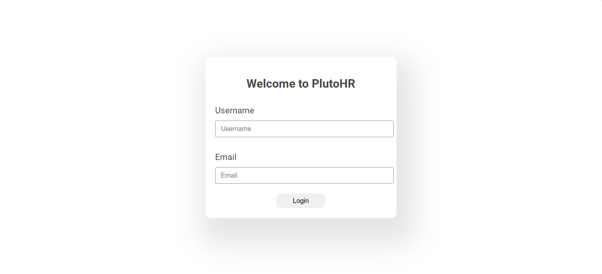
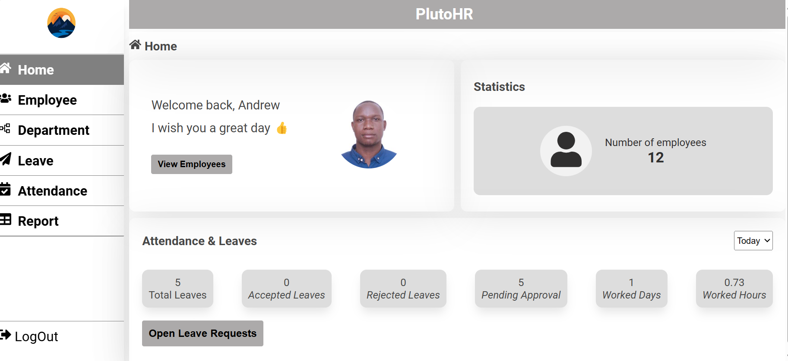
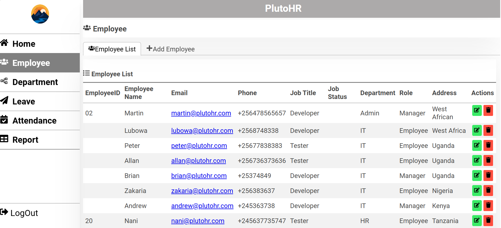
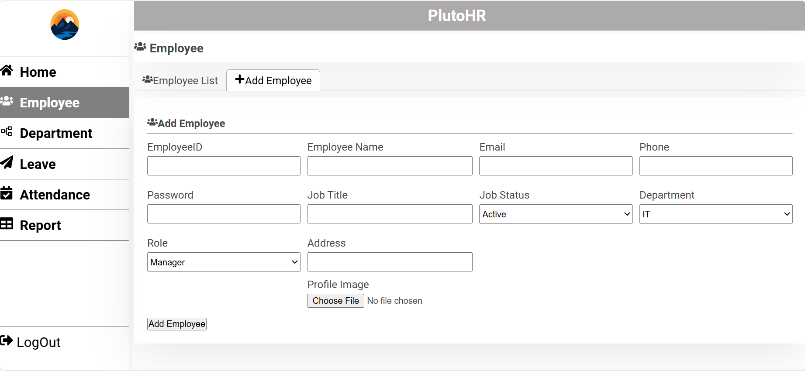
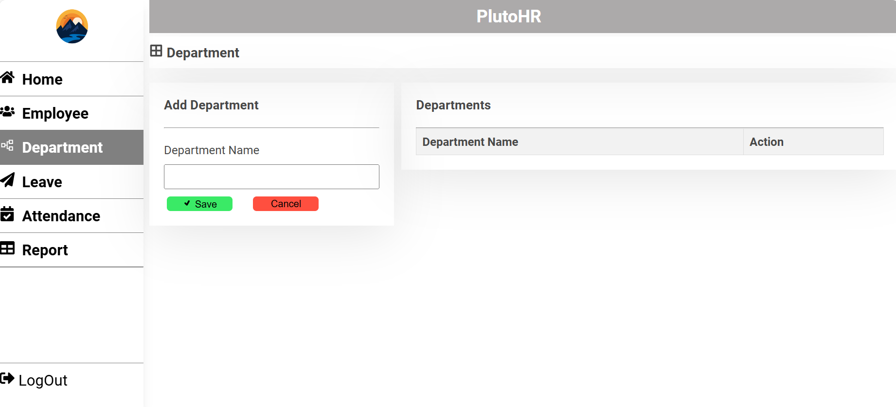
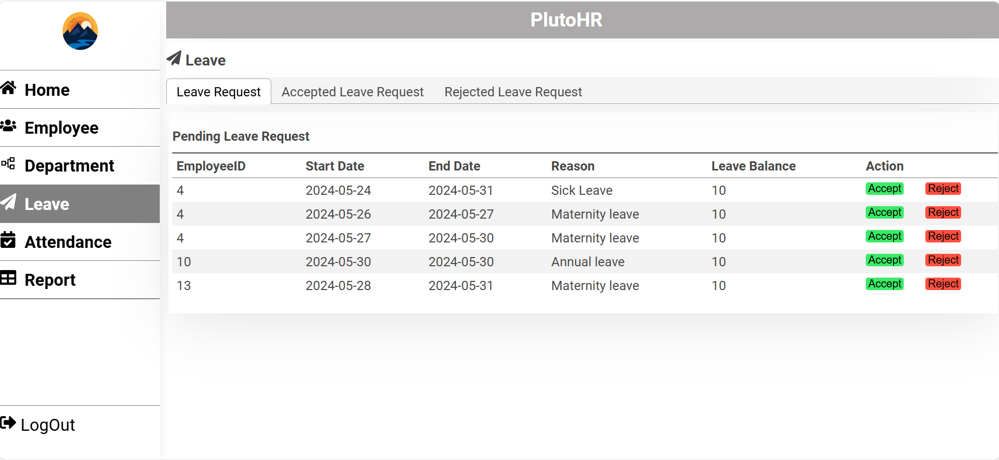
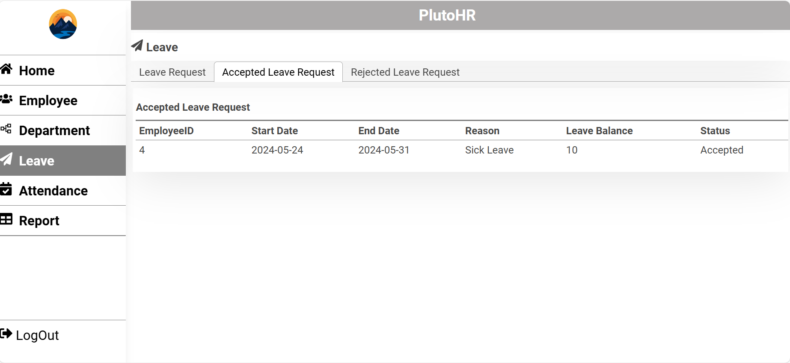
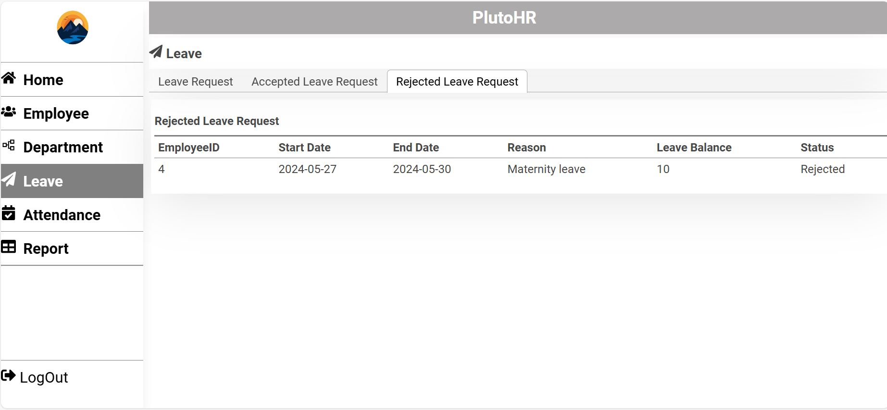
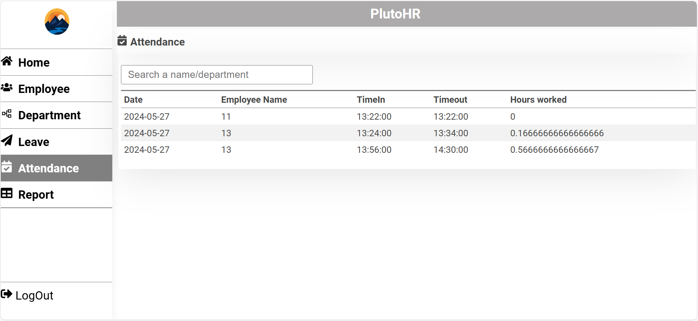
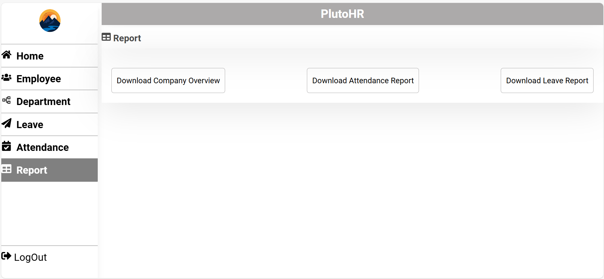
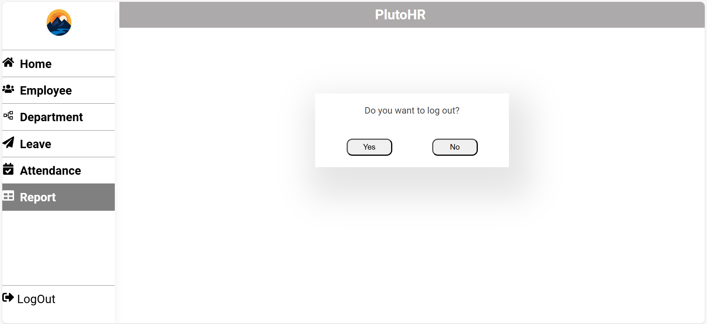
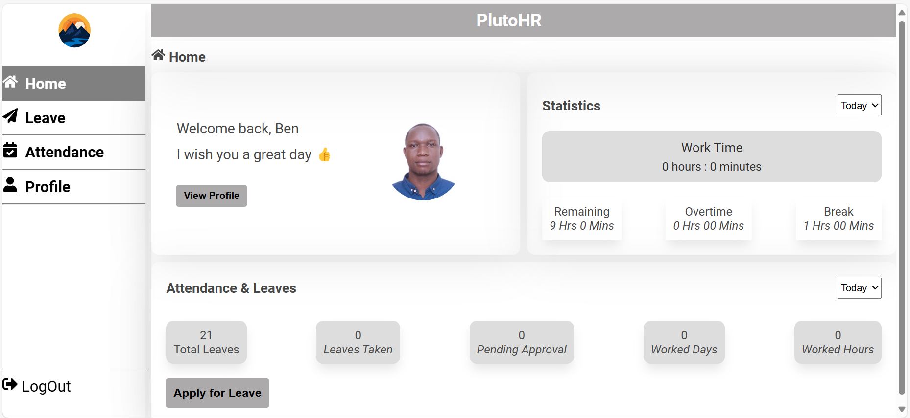
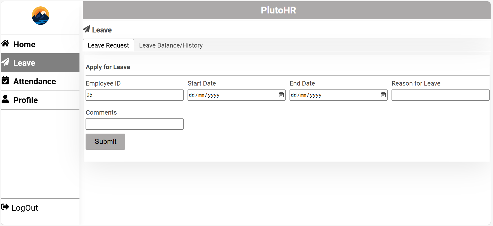
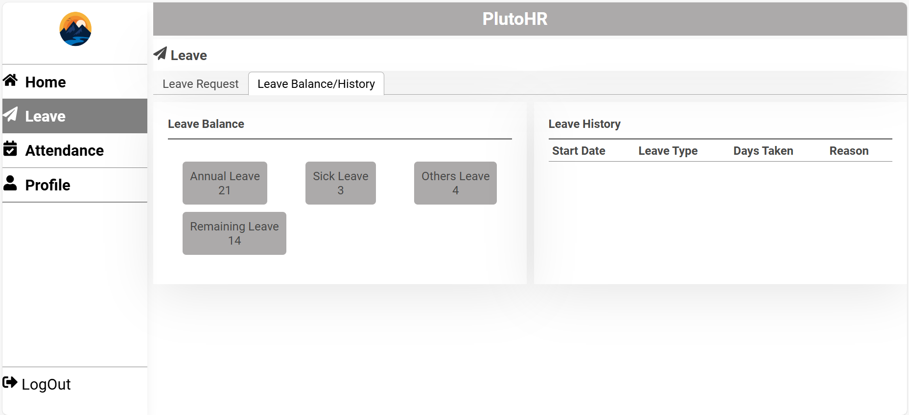
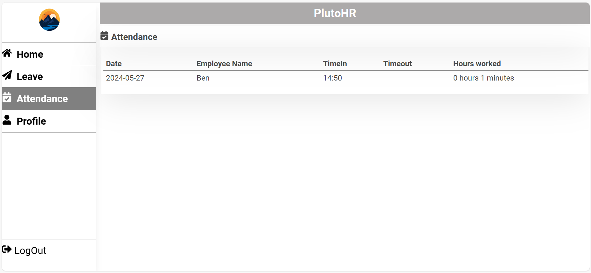
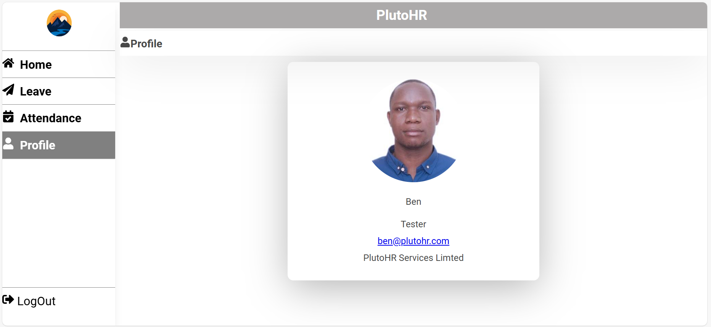

## Room for Improvement

Room for improvement:
- Improve the api endpoints
- Display specific user attendance to the user
- Improve login authentication
## Project Status
Project is: _in progress_ 
## Contact
Created by <martinlubowa@outlook.com> and <oryemasteve9@gmail.com> - feel free to contact us!
